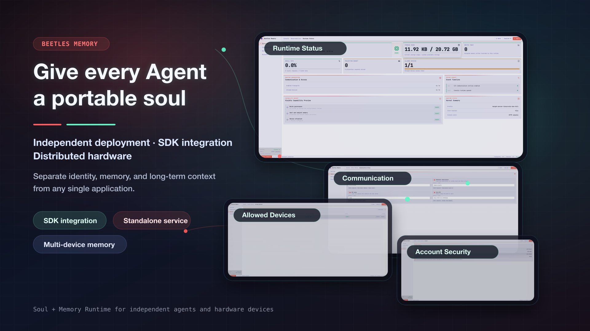
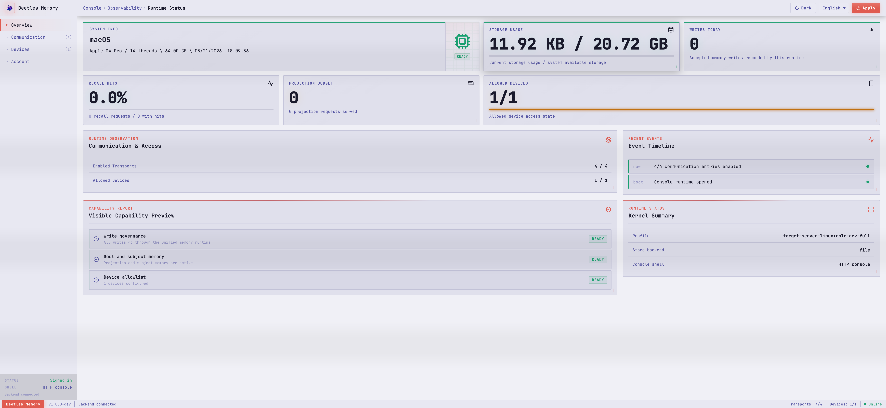
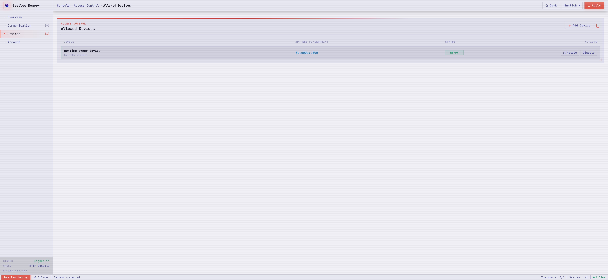
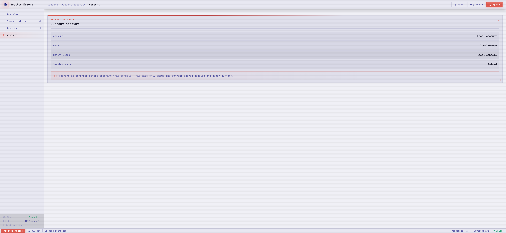

# Beetle Memory

English | [中文](README.zh-CN.md)



Beetle Memory is a Rust memory runtime for agent systems. It provides an SDK-first integration path, owned storage backends, profile-based platform trimming, replay and governed archive tools, and thin protocol adapters for standalone deployment.

The project is not a vector database, a generic RAG framework, a chat-history dump, a workflow runner, or a tool execution runtime. Its job is to own memory state, memory operations, lifecycle reports, profile capability visibility, and archive/replay contracts.

## What Is In This Repository

| Area | Crates |
| --- | --- |
| SDK and memory core | `bm-sdk`, `bm-core` |
| Persistence kernel | Private `bm-sdk` module behind the opaque `MemoryStoreHandle` |
| Persistence contract tests | `bm-store-contract-tests` (development acceptance only) |
| Replay and proposal sandbox | `bm-replay`, `bm-evolve` |
| Protocol contract and entry runtime | `bm-adapter`, `bm-entry` |
| Model gateway and transparent local-model control | `bm-llm-gateway`, `bm-ollama-transparent` |
| Adapters | `bm-cli`, `bm-http`, `bm-wss`, `bm-mcp`, `bm-a2a` |

The Cargo workspace is prepared as a local `0.6.0` source candidate. See the [0.6.0 source candidate notes](docs/en/release-notes-0.6.0.md) before opening a persistent store. This is a clean-break Store v12 release with no v11 migration or compatibility reader. The repository includes five smoke-test examples under `examples/` and platform capability fixtures under `fixtures/platform/capabilities/`.

## Capabilities

- Build a `MemoryRuntime` from an identity, scope, profile, and store backend.
- Write policy-checked procedural memory and long-term extraction results.
- Recall memory across working, procedural, long-term, and continuity surfaces.
- Project a bounded memory block for model context assembly.
- Inspect runtime state, lifecycle reports, and operator-safe recovery actions.
- Provision, govern, archive, reset, reseed, delete, and safely inspect an AgentPersona Soul without inventing a default personality or exporting inward raw material.
- Export and import typed memory-space archives, and replay governed runtime history; continuity snapshots remain internal Soul-recovery payloads.
- Run through SDK, CLI, HTTP, WebSocket, MCP, or A2A adapter shells without duplicating memory semantics.
- Compile for ESP, Linux hardware devices, the macOS standalone desktop app, macOS/Windows/Linux SDK hosts, and Linux server gateway profiles.

## Console Preview

Standalone deployments include a shared console UI that can run inside the macOS Tauri desktop app or the HTTP Console Shell. It includes Overview, Skill Memory, LLM Gateway, Communication, Devices, and Account pages. Skill Memory manages procedural memory records through the same `MemoryRuntime` governance path; it does not execute skills or install tools.

| Runtime Status | Communication Setup |
| --- | --- |
|  |  |
| Allowed Devices | Account Security |
|  |  |

## Quick Start

For local development from this repository:

```toml
[dependencies]
bm-sdk = { path = "crates/sdk", features = ["profile-desktop-macos-embedded-sdk"] }
```

After publishing, use the crate version instead of a path dependency.

```rust
use bm_sdk::{
    AgentSkillDirConfig, MemoryIdentity, MemoryProjectionRequest, MemoryRecallRequest,
    MemoryRecallTemporalOperation, MemoryRuntime, MemoryScope, MemoryStoreHandle,
    MemoryWriteRequest, PressureLevel, ProfileId, RuntimeLifecycleModeInput, RuntimeSkillWrite,
    RuntimeSkillWriteSource, StoreBackendConfig,
};

fn build_runtime() -> bm_sdk::Result<MemoryRuntime> {
    let profile = ProfileId::DesktopMacosEmbeddedSdk;
    let store = MemoryStoreHandle::open(StoreBackendConfig::in_memory(profile)?)?;

    MemoryRuntime::builder()
        .identity(MemoryIdentity::new("agent-main", "owner-default")?)
        .scope(MemoryScope::new("local", "chat-1")?)
        .store(store)
        .add_agent_skill_dir(AgentSkillDirConfig::read_only(
            "./skills",
            "host-project",
        ))
        .build()
}

fn smoke(runtime: &MemoryRuntime) -> bm_sdk::Result<()> {
    runtime.write(MemoryWriteRequest::Procedural {
        writes: vec![RuntimeSkillWrite {
            name: "release_guard".to_string(),
            topic: "release".to_string(),
            title: "Release guard".to_string(),
            summary: "Verify release artifacts before publishing.".to_string(),
            content: "Run examples, platform gates, and publish dry-run.".to_string(),
            citations: vec!["quickstart".to_string()],
            source_chat_id: Some("chat-1".to_string()),
            observed_at: 1_800_000_000,
        }],
        source: RuntimeSkillWriteSource::Manual,
    })?;

    let recall = runtime.recall(MemoryRecallRequest {
        temporal_operation: MemoryRecallTemporalOperation::Current,
        query: "release artifacts".to_string(),
        limit: 4,
        structured_query_facets: Vec::new(),
        tool_registry_refs: Vec::new(),
    })?;
    assert!(recall
        .procedural_delivery_reports
        .iter()
        .any(|delivery| delivery.selected));

    let projection = runtime.project(MemoryProjectionRequest {
        temporal_operation: MemoryRecallTemporalOperation::Current,
        user_query: "How should this host release?".to_string(),
        system_max_len: 4096,
        recent_messages_limit: 8,
        pressure: PressureLevel::Normal,
        mode_input: RuntimeLifecycleModeInput::default(),
        structured_query_facets: Vec::new(),
        tool_registry_refs: Vec::new(),
    })?;
    assert!(projection.system_memory_block.len() <= 4096);
    Ok(())
}
```

## Documentation

English documentation:

- [Architecture](docs/en/architecture.md)
- [Integration Guide](docs/en/integration.md)
- [LLM Gateway Integrations](docs/en/llm-gateway-integrations.md)
- [Deployment Guide](docs/en/deployment.md)
- [CLI Usage](docs/en/cli-usage.md)
- [Getting Started](docs/en/getting-started.md)
- [API Surface](docs/en/api.md)
- [Profiles](docs/en/profiles.md)
- [Store Backends](docs/en/store-backends.md)
- [Adapters](docs/en/adapters.md)
- [Replay and Archive](docs/en/replay-and-archive.md)
- [Operator Guide](docs/en/operator-guide.md)
- [Release Checklist](docs/en/release-checklist.md)
- [0.6.0 Source Candidate Notes](docs/en/release-notes-0.6.0.md)
- [0.5.0 Release Notes](docs/en/release-notes-0.5.0.md)
- [0.4.0 Release Notes](docs/en/release-notes-0.4.0.md)
- [0.3.0 Release Notes](docs/en/release-notes-0.3.0.md)

中文文档：

- [架构文档](docs/zh-CN/architecture.md)
- [集成文档](docs/zh-CN/integration.md)
- [LLM Gateway 集成](docs/zh-CN/llm-gateway-integrations.md)
- [部署文档](docs/zh-CN/deployment.md)
- [CLI 使用](docs/zh-CN/cli-usage.md)
- [快速开始](docs/zh-CN/getting-started.md)
- [API 表面](docs/zh-CN/api.md)
- [Profile 矩阵](docs/zh-CN/profiles.md)
- [存储后端](docs/zh-CN/store-backends.md)
- [Adapter 合同](docs/zh-CN/adapters.md)
- [回放与归档](docs/zh-CN/replay-and-archive.md)
- [运维与检查](docs/zh-CN/operator-guide.md)
- [发布清单](docs/zh-CN/release-checklist.md)
- [0.6.0 源码候选说明](docs/zh-CN/release-notes-0.6.0.md)
- [0.5.0 发布说明](docs/zh-CN/release-notes-0.5.0.md)
- [0.4.0 发布说明](docs/zh-CN/release-notes-0.4.0.md)
- [0.3.0 发布说明](docs/zh-CN/release-notes-0.3.0.md)

The documentation index is [docs/README.md](docs/README.md).

## Profiles

| Profile feature | Target | Runtime role | Default store posture |
| --- | --- | --- | --- |
| `profile-esp-standalone-memory` | ESP | standalone memory runtime | embedded or in-memory |
| `profile-esp-embedded-sdk` | ESP | embedded SDK | embedded or in-memory |
| `profile-linux-device-standalone-memory` | Linux hardware device | standalone memory runtime | file or sqlite |
| `profile-desktop-macos-standalone-memory` | macOS | standalone desktop app | file or sqlite |
| `profile-desktop-macos-embedded-sdk` | macOS | embedded SDK | file, sqlite, or in-memory |
| `profile-desktop-macos-dev-full` | macOS | nonproduction development profile | sqlite, file, or in-memory |
| `profile-desktop-windows-embedded-sdk` | Windows | embedded SDK | file, sqlite, or in-memory |
| `profile-desktop-windows-dev-full` | Windows | nonproduction development profile | sqlite, file, or in-memory |
| `profile-desktop-linux-embedded-sdk` | Linux desktop | embedded SDK | file, sqlite, or in-memory |
| `profile-server-linux-memory-gateway` | Linux server | memory gateway | sqlite or file |
| `profile-server-linux-dev-full` | Linux server | nonproduction development profile | sqlite, file, or in-memory |

ESP profiles reject file and sqlite stores at configuration time. Server, desktop, and Linux-device profiles can use sqlite when the matching profile/store feature is enabled.
Every `*-dev-full` profile enables the nonproduction replay harness and must match the actual host target; it is never a production default.

## Examples

```bash
cargo run --manifest-path examples/rust-sdk-embedded/Cargo.toml
cargo run --manifest-path examples/rust-sdk-embedded/Cargo.toml --no-default-features --features desktop-linux
cargo run --manifest-path examples/server-runtime/Cargo.toml
cargo run --manifest-path examples/linux-device/Cargo.toml
cargo run --manifest-path examples/esp-standalone-memory/Cargo.toml
cargo run --manifest-path examples/esp-embedded-sdk/Cargo.toml
```

## Verification

Common local checks:

```bash
cargo fmt --all -- --check
cargo test --locked --workspace --exclude bm-desktop
cargo clippy --locked --workspace --exclude bm-desktop --all-targets -- -D warnings
# On macOS, validate the standalone desktop with its required production profile.
cargo test --locked -p bm-desktop --no-default-features \
  --features profile-desktop-macos-standalone-memory
cargo clippy --locked -p bm-desktop --all-targets --no-default-features \
  --features profile-desktop-macos-standalone-memory -- -D warnings
bash scripts/check_profile_matrix.sh
bash scripts/check_next_gen_memory_plan.sh
bash scripts/check_release_surface.sh
```

An engineering handoff from a host that lacks a required target toolchain may record that row as
`deferred_not_passed`. Every release candidate must provision the complete target-toolchain set and
obtain a strict GREEN result; a missing toolchain blocks release and is never a pass:

```bash
bash scripts/check_cross_target_compile_gates.sh --strict
```

## License

Apache-2.0. See [LICENSE](LICENSE).
