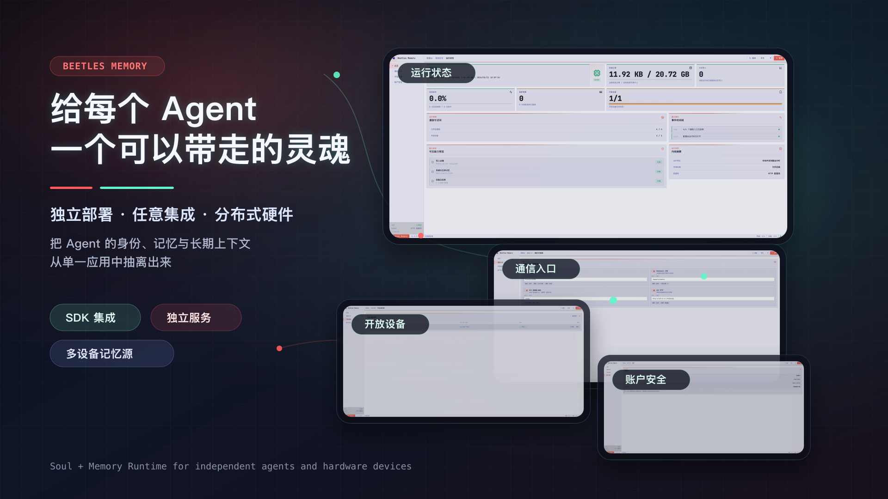
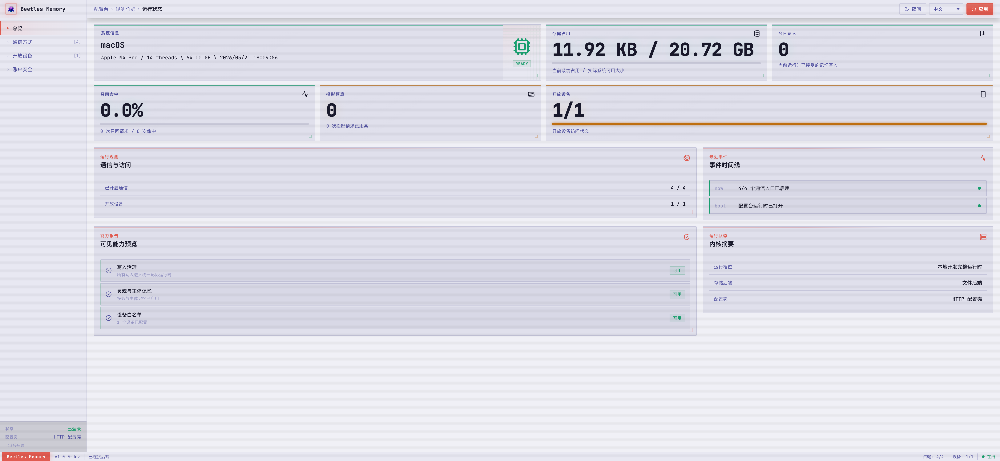
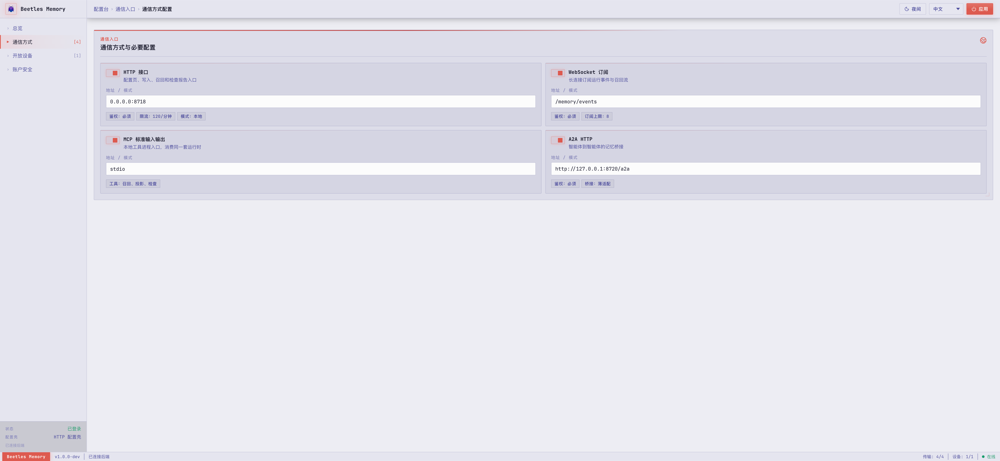
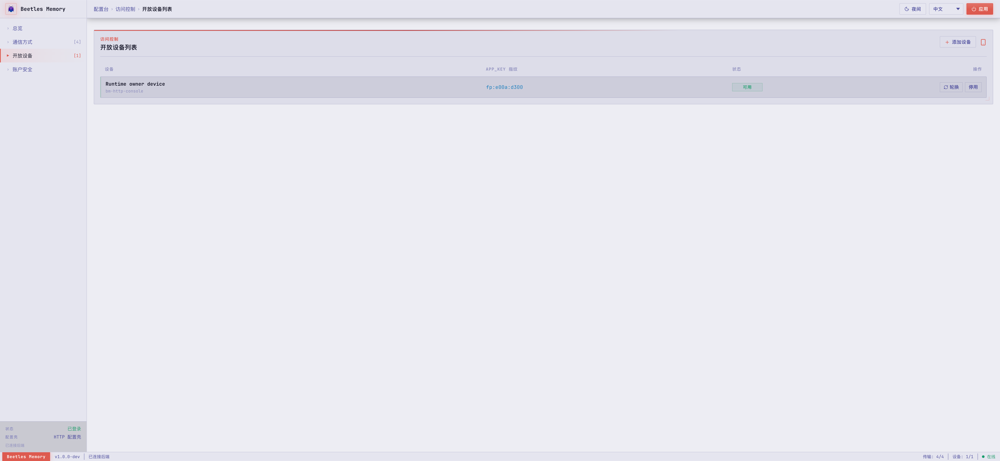
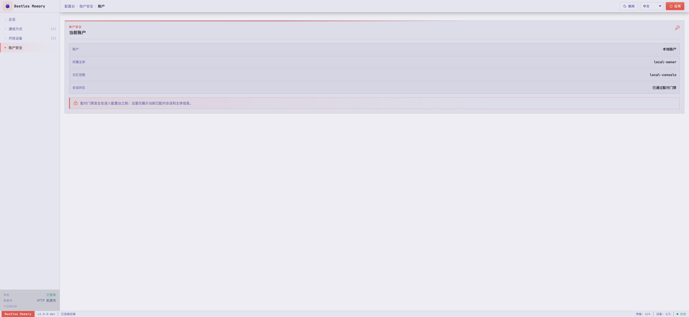

# Beetle Memory

[English](README.md) | 中文



Beetle Memory 是面向 agent 系统的 Rust 记忆运行时。它提供 SDK-first 集成入口、自有存储后端、基于 profile 的平台裁剪、回放与受治理归档工具，以及用于独立部署的轻量协议 adapter。

它不是向量数据库、通用 RAG 框架、聊天历史归档、workflow runner 或工具执行运行时。它负责记忆状态、记忆操作、生命周期报告、profile 能力可见性，以及归档和回放合同。

## 仓库内容

| 领域 | Crates |
| --- | --- |
| SDK 与记忆核心 | `bm-sdk`, `bm-core` |
| 持久化内核 | `bm-sdk` 内的私有模块，经由不透明的 `MemoryStoreHandle` 访问 |
| 持久化合同测试 | `bm-store-contract-tests`（仅开发验收） |
| 回放与提案沙箱 | `bm-replay`, `bm-evolve` |
| 协议合同与入口运行时 | `bm-adapter`, `bm-entry` |
| 模型网关与透明本地模型控制 | `bm-llm-gateway`, `bm-ollama-transparent` |
| Adapters | `bm-cli`, `bm-http`, `bm-wss`, `bm-mcp`, `bm-a2a` |

当前 Cargo workspace 已准备为本地 `0.5.0` source candidate。打开或迁移已有持久 Store 前，请先阅读 [0.5.0 源码候选说明](docs/zh-CN/release-notes-0.5.0.md)。仓库包含 `examples/` 下的五个 smoke 示例，以及 `fixtures/platform/capabilities/` 下的 profile capability fixtures。

## 能力范围

- 通过 identity、scope、profile 和 store backend 构建 `MemoryRuntime`。
- 写入受规则约束的 procedural memory 和 long-term extraction 结果。
- 从 working、procedural、long-term、continuity 等表面召回记忆。
- 生成受长度限制的模型上下文 memory block。
- 检查运行状态、生命周期报告和 operator-safe recovery action。
- 在不生成默认人格、不导出内在 raw material 的前提下，完成 AgentPersona Soul 的建档、治理、归档、reset、reseed、delete 与安全检查。
- 导出、导入 typed memory-space archive，并回放受治理的 runtime history；continuity snapshot 仅作为内部 Soul recovery 载荷。
- 通过 SDK、CLI、HTTP、WebSocket、MCP 或 A2A adapter shell 进入同一套记忆语义。
- 面向 ESP、Linux 硬件设备、macOS 桌面独立 App、macOS/Windows/Linux SDK 宿主和 Linux server gateway profile 编译。

## 控制台预览

独立部署形态提供共享配置台页面，当前可由 macOS Tauri 桌面 App 或 HTTP Console Shell 承载。页面包含总览、Skill 记忆、通信方式、开放设备和账户安全。Skill 记忆页通过同一套 `MemoryRuntime` governance 管理 procedural memory record，不执行 skill，也不安装工具。

| 运行状态 | 通信方式配置 |
| --- | --- |
|  |  |
| 开放设备列表 | 账户安全 |
|  |  |

## 快速开始

在本仓库内做本地开发时：

```toml
[dependencies]
bm-sdk = { path = "crates/sdk", features = ["profile-desktop-macos-embedded-sdk"] }
```

发布到 registry 后，使用 crate 版本号替代 path dependency。

```rust
use bm_sdk::{
    AgentSkillDirConfig, MemoryIdentity, MemoryProjectionRequest, MemoryRecallRequest,
    MemoryRecallTemporalOperation, MemoryRuntime, MemoryScope, MemoryStoreHandle,
    MemoryWriteRequest, PressureLevel, ProfileId, RuntimeLifecycleModeInput, RuntimeSkillWrite,
    RuntimeSkillWriteSource, StoreBackendConfig,
};

fn build_runtime() -> bm_sdk::Result<MemoryRuntime> {
    let profile = ProfileId::DesktopMacosEmbeddedSdk;
    let store = MemoryStoreHandle::open(StoreBackendConfig::in_memory(profile)?)?;

    MemoryRuntime::builder()
        .identity(MemoryIdentity::new("agent-main", "owner-default")?)
        .scope(MemoryScope::new("local", "chat-1")?)
        .store(store)
        .add_agent_skill_dir(AgentSkillDirConfig::read_only(
            "./skills",
            "host-project",
        ))
        .build()
}

fn smoke(runtime: &MemoryRuntime) -> bm_sdk::Result<()> {
    runtime.write(MemoryWriteRequest::Procedural {
        writes: vec![RuntimeSkillWrite {
            name: "release_guard".to_string(),
            topic: "release".to_string(),
            title: "Release guard".to_string(),
            summary: "Verify release artifacts before publishing.".to_string(),
            content: "Run examples, platform gates, and publish dry-run.".to_string(),
            citations: vec!["quickstart".to_string()],
            source_chat_id: Some("chat-1".to_string()),
            observed_at: 1_800_000_000,
        }],
        source: RuntimeSkillWriteSource::Manual,
    })?;

    let recall = runtime.recall(MemoryRecallRequest {
        temporal_operation: MemoryRecallTemporalOperation::Current,
        query: "release artifacts".to_string(),
        limit: 4,
        structured_query_facets: Vec::new(),
        tool_registry_refs: Vec::new(),
    })?;
    assert!(recall
        .procedural_delivery_reports
        .iter()
        .any(|delivery| delivery.selected));

    let projection = runtime.project(MemoryProjectionRequest {
        temporal_operation: MemoryRecallTemporalOperation::Current,
        user_query: "How should this host release?".to_string(),
        system_max_len: 4096,
        recent_messages_limit: 8,
        pressure: PressureLevel::Normal,
        mode_input: RuntimeLifecycleModeInput::default(),
        structured_query_facets: Vec::new(),
        tool_registry_refs: Vec::new(),
    })?;
    assert!(projection.system_memory_block.len() <= 4096);
    Ok(())
}
```

## 文档

中文文档：

- [架构文档](docs/zh-CN/architecture.md)
- [集成文档](docs/zh-CN/integration.md)
- [LLM Gateway 集成](docs/zh-CN/llm-gateway-integrations.md)
- [部署文档](docs/zh-CN/deployment.md)
- [CLI 使用](docs/zh-CN/cli-usage.md)
- [快速开始](docs/zh-CN/getting-started.md)
- [API 表面](docs/zh-CN/api.md)
- [Profile 矩阵](docs/zh-CN/profiles.md)
- [存储后端](docs/zh-CN/store-backends.md)
- [Adapter 合同](docs/zh-CN/adapters.md)
- [回放与归档](docs/zh-CN/replay-and-archive.md)
- [运维与检查](docs/zh-CN/operator-guide.md)
- [发布清单](docs/zh-CN/release-checklist.md)
- [0.5.0 源码候选说明](docs/zh-CN/release-notes-0.5.0.md)
- [0.4.0 发布说明](docs/zh-CN/release-notes-0.4.0.md)
- [0.3.0 发布说明](docs/zh-CN/release-notes-0.3.0.md)

English documentation:

- [Architecture](docs/en/architecture.md)
- [Integration Guide](docs/en/integration.md)
- [Deployment Guide](docs/en/deployment.md)
- [CLI Usage](docs/en/cli-usage.md)
- [Getting Started](docs/en/getting-started.md)
- [API Surface](docs/en/api.md)
- [Profiles](docs/en/profiles.md)
- [Store Backends](docs/en/store-backends.md)
- [Adapters](docs/en/adapters.md)
- [Replay and Archive](docs/en/replay-and-archive.md)
- [Operator Guide](docs/en/operator-guide.md)
- [Release Checklist](docs/en/release-checklist.md)
- [0.5.0 Source Candidate Notes](docs/en/release-notes-0.5.0.md)
- [0.4.0 Release Notes](docs/en/release-notes-0.4.0.md)
- [0.3.0 Release Notes](docs/en/release-notes-0.3.0.md)

文档索引见 [docs/README.md](docs/README.md)。

## Profiles

| Profile feature | 目标 | 运行角色 | 默认 store 姿态 |
| --- | --- | --- | --- |
| `profile-esp-standalone-memory` | ESP | standalone memory runtime | embedded 或 in-memory |
| `profile-esp-embedded-sdk` | ESP | embedded SDK | embedded 或 in-memory |
| `profile-linux-device-standalone-memory` | Linux 硬件设备 | standalone memory runtime | file 或 sqlite |
| `profile-desktop-macos-standalone-memory` | macOS | standalone desktop app | file 或 sqlite |
| `profile-desktop-macos-embedded-sdk` | macOS | embedded SDK | file、sqlite 或 in-memory |
| `profile-desktop-macos-dev-full` | macOS | 非生产开发 profile | sqlite、file 或 in-memory |
| `profile-desktop-windows-embedded-sdk` | Windows | embedded SDK | file、sqlite 或 in-memory |
| `profile-desktop-windows-dev-full` | Windows | 非生产开发 profile | sqlite、file 或 in-memory |
| `profile-desktop-linux-embedded-sdk` | Linux 桌面 | embedded SDK | file、sqlite 或 in-memory |
| `profile-server-linux-memory-gateway` | Linux server | memory gateway | sqlite 或 file |
| `profile-server-linux-dev-full` | Linux server | 非生产开发 profile | sqlite、file 或 in-memory |

ESP profile 会在配置时拒绝 file 和 sqlite store。server、desktop 和 Linux-device profile 在启用对应 profile/store feature 后可以使用 sqlite。
所有 `*-dev-full` profile 都会启用非生产 replay harness，且必须与真实宿主 target 匹配；它们从来不是生产默认值。

## 示例

```bash
cargo run --manifest-path examples/rust-sdk-embedded/Cargo.toml
cargo run --manifest-path examples/rust-sdk-embedded/Cargo.toml --no-default-features --features desktop-linux
cargo run --manifest-path examples/server-runtime/Cargo.toml
cargo run --manifest-path examples/linux-device/Cargo.toml
cargo run --manifest-path examples/esp-standalone-memory/Cargo.toml
cargo run --manifest-path examples/esp-embedded-sdk/Cargo.toml
```

## 验证

常用本地检查：

```bash
cargo fmt --all -- --check
cargo test --locked --workspace
cargo clippy --locked --workspace --all-targets -- -D warnings
bash scripts/check_profile_matrix.sh
bash scripts/check_next_gen_memory_plan.sh
bash scripts/check_release_surface.sh
```

缺少必要目标工具链的开发机可以在工程交接中将对应行记录为 `deferred_not_passed`。
任何发布候选都必须配置完整目标工具链并取得 strict GREEN；工具链缺失会阻断发布，绝不算通过：

```bash
bash scripts/check_cross_target_compile_gates.sh --strict
```

## License

Apache-2.0. See [LICENSE](LICENSE).
